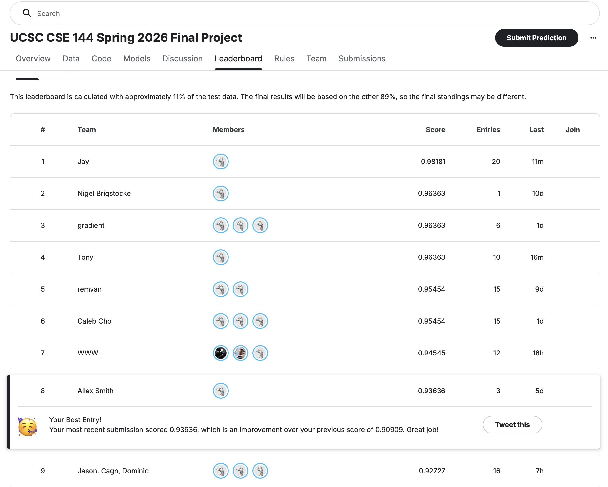

# CSE 144 Final Project: Few-Shot Image Classification

100-class image classification with only ~10 training images per class. Uses a frozen DINOv3 ViT-L/16 backbone with a lightweight trainable head, LoRA adaptation on the last transformer blocks, ensembled with SIGLIP2 with an MLP head, heavy data augmentation, and test-time augmentation (TTA).

## Results



## Setup

Requires Python 3.11 and an Apple Silicon Mac (MPS backend) or CUDA GPU.

Setting PYTORCH_ENABLE_MPS_FALLBACK before training is slightly redundant here but it avoids ambiguity on code excecution order. This was causing me some major crashes on mac, but likely not needed for CUDA.

To reproduce the model used for kaggle run the following (WARNING: training takes a very long time):

```bash
pip install -r requirements.txt
PYTORCH_ENABLE_MPS_FALLBACK=1 python scripts/train.py --config configs/dinov3_lora.yaml
PYTORCH_ENABLE_MPS_FALLBACK=1 python scripts/train.py --config configs/siglip_linear.yaml
python scripts/predict_ensemble.py \
--checkpoints outputs/checkpoints/dinov3_lora_best.pth outputs/checkpoints/siglip_linear_best.pth \
--weights 1.0 1.0 \
--out submission.csv
```

## Weights

Pre-trained model weights (contains best trained run for dino and siglip): 
https://drive.google.com/drive/folders/1QZ9GpTE5Nr7WnTD4cI1VK2Vfink-GqXP?usp=share_link

## Reproducibility

- Default seed: 42
- Set via `--seed N` or in the config YAML
- Deterministic algorithms enabled (`torch.use_deterministic_algorithms(True, warn_only=True)`)
- Small variance expected due to MPS non-determinism; typical accuracy spread is ~0.5% across seeds